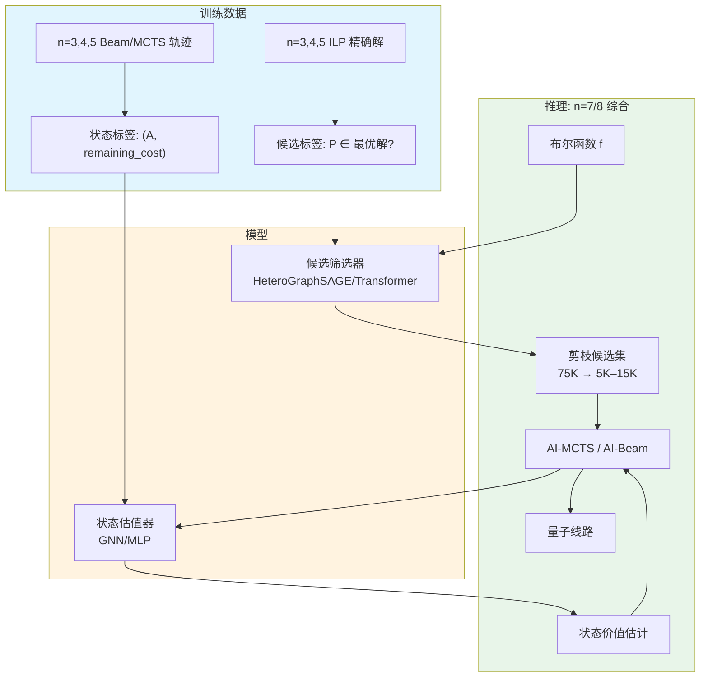
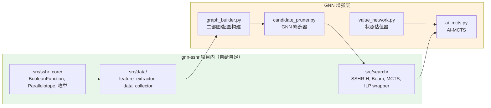
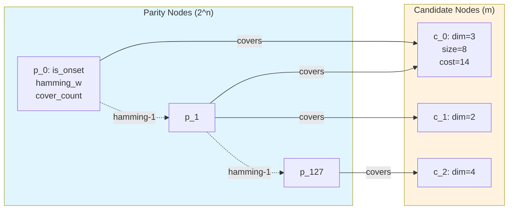
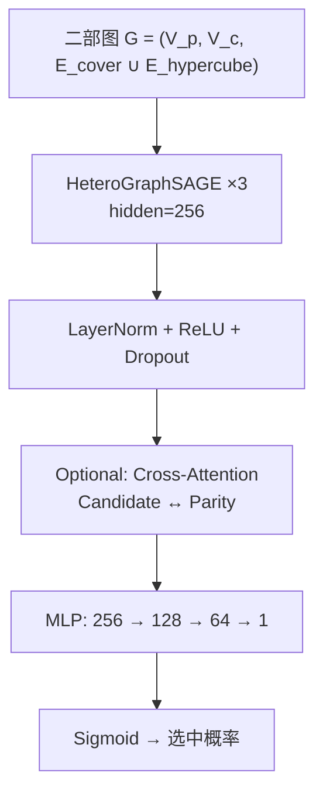
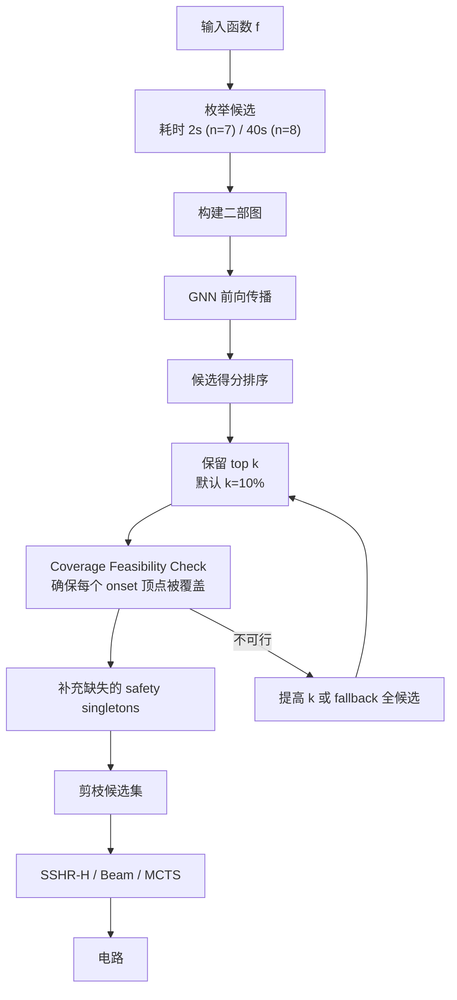
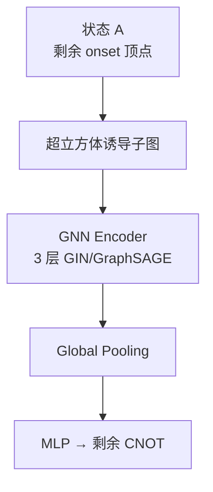
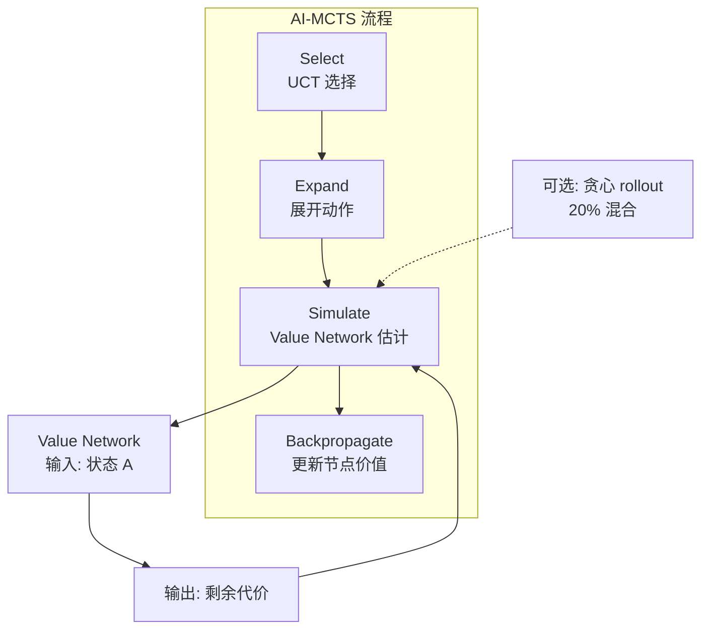
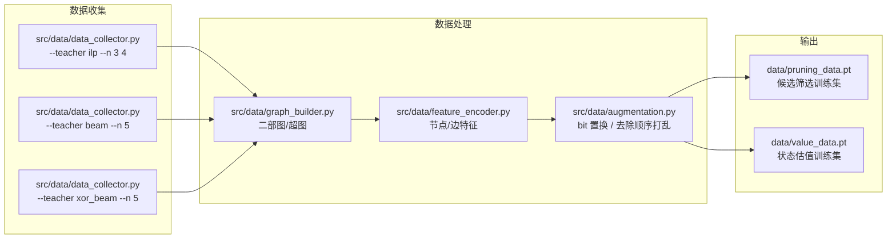
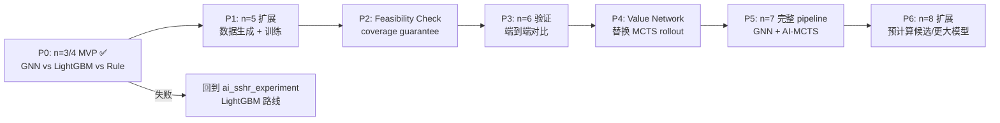

# GNN-SSHR: 基于图神经网络的 SSHR 算法增强

> 项目目标：探索用图神经网络（GNN）替代 `ai_sshr_experiment` 中的手工特征 + LightGBM ranker，解决 SSHR 在大规模（n=7,8）下的**候选空间爆炸**和**搜索效率低下**两个瓶颈。

**当前状态**：P0.2 ⚠️ PARTIAL — cost-aware 特征（cnot_cost / t_cost / control_count，11 维候选节点）落地，GNN 在 n=3 **超过** LGB（best gnn/lgb = 3232/3354 = 0.964，−3.64 %）并在 n=5 **追平** LGB（2658/2658 = 1.000，T 与 Anc 反超）。但 n=4 仍落后 LGB 2.83 %（5079/4939 @ 0.50，超过 §5.2 "≤2 %" 阈值 0.83 pp），是唯一未通过的比例。Anc 聚合已改为累加（our_sshr_h n=3 Anc 1→128，与论文 Table V 一致），coverage 修复保持（所有 n 所有 keep_ratio 下 `n_skipped=0`）。`最小 singleton 修复`（H）因 workflow 中断未实施，P0.1 的 brute-force singleton-injection 仍在使用。详见 [PROGRESS.md §9](./PROGRESS.md#9-p02-cost-aware-features--n5-june-13-2026)。下一步：P0.3（n=4 更长重训 + minimum-singleton 修复）或进入 P1。

---

## 1. 问题分析

### 1.1 当前瓶颈

论文 SSHR 方法在 n≥7 时面临两个根本问题：

| 指标 | n=5 | n=6 | n=7 | n=8 |
|------|-----|-----|-----|-----|
| 候选平行体数 | 1,539 | 10,299 | **75,905** | **609,441** |
| 候选-顶点边数 | 6,496 | 56,128 | **529,920** | **5,413,632** |
| 枚举时间 | 0.012s | 0.147s | **2.241s** | **40.579s** |
| ILP 求解 | 可行（慢） | 困难（常超时） | **完全不可行** | **完全不可行** |
| SSHR-H 效果 | 好 | 中等 | **退化** | **严重退化** |
| MCTS/Beam | 好 | 可用 | **慢但可用** | **太慢** |

### 1.2 瓶颈根源

**瓶颈 1：候选空间爆炸**

n=7 时有 75,905 个候选平行体、约 53 万条覆盖边。每个函数的 ILP 需要处理 75,905 个二值变量 + 128 个奇偶约束，Gurobi 无法在合理时间内求解。即使启发式搜索（SSHR-H、Beam），每步都需要评估数万个候选。

**瓶颈 2：搜索策略低效**

MCTS 的贪心 rollout 只看局部最优，无法评估"当前选择对未来代价的影响"。UCT 依赖 rollout 质量来分配搜索预算，低质量的 rollout 导致大量无效探索。

### 1.3 为什么 AI 能解决

- 候选筛选是**模式识别问题**：从数万候选中识别出几千个高价值候选，需要理解 onset 分布与平行体结构的关系，这正是深度学习擅长的。
- 状态估值是**回归问题**：给定当前剩余 onset，预测最少还需要多少 CNOT，可以从已求解的小 n 实例中学习。

**已有的基础**：`ai_sshr_experiment` 已验证 ML ranker（LightGBM）在 n=4–6 相比 rule ranker 有 1–2% 的 CNOT 提升。GNN 有望进一步捕捉候选之间的几何关系，但需严格验证。

---

## 2. 技术方案：双模型架构



### 2.1 与现有 `ai_sshr_experiment` 的关系



**项目独立性**：`gnn-sshr` 是一个自包含项目。所有 SSHR 核心算法、候选特征提取、数据收集脚本都直接放在本项目内（`src/sshr_core/` 和 `src/data/`），不依赖外部目录。这样保证：
- 可独立运行、独立版本控制
- 可移植到本地机器或云端
- 避免被 `ai_sshr_experiment/` 的后续改动破坏

与 `ai_sshr_experiment/` 的关系是**参考与对比**，不是依赖。

---

### 2.2 模型 1：候选筛选器（Candidate Pruner）

**目标**：对 n=7,8 的函数，从数万候选中筛选出几千个高价值候选，使后续搜索/ILP 变得可行。

**为什么用大模型**：候选筛选是一次性操作（每个函数跑一次推理），不需要实时性。可以用更大的模型获得更好的筛选质量。关键在于识别出"看起来不起眼但对最终解很关键"的候选。

#### 2.2.1 输入表示

采用**二部图 + 超立方体邻接边**（参考 Graph-SCP, CoCo-MILP）：



**节点特征**：

| 节点类型 | 特征 | 维度 |
|---|---|---|
| Parity | is_onset, hamming_weight, bit_pattern[0..n-1], cover_count, neighbor_onset_ratio | 8 |
| Candidate | dim, size, log_size, cnot_cost, t_cost, control_count, is_singleton, overlap_ratio, off_ratio, cover_density, dim_cost_ratio, unique_cover, structural_rarity, position_entropy | 16+ |

**边类型**：
1. **覆盖边**（Parity ↔ Candidate）：candidate 覆盖 parity 顶点
2. **超立方体邻接边**（Parity ↔ Parity）：hamming distance = 1

> **注**：README v1 只用了二部图，未建模 parity 之间的邻接关系。新增邻接边有助于 GNN 理解 on-set 在超立方体中的几何结构。

#### 2.2.2 模型架构

采用 **Heterogeneous Graph Neural Network**，第一阶段先用 HeteroGraphSAGE，必要时再升级为 Transformer：



**架构细节**：
- 层 1–3：HeteroGraphSAGE 消息传递
  - Parity → Candidate：聚合被覆盖的 parity 信息
  - Candidate → Parity：聚合覆盖该 parity 的候选信息
  - 每层后接 LayerNorm + ReLU + Dropout(0.1)
  - 隐藏维度：256
- 层 4–5（可选）：Cross-Attention 精炼
  - Candidate nodes attend to Parity nodes
  - Multi-head attention（8 heads）
  - **注意**：Cross-Attention 复杂度为 O(|candidate| × |parity|)，n=8 时达 1.56 亿，可能过慢。建议先用 SAGE 验证 baseline。
- 层 6：候选分类头
  - MLP: 256 → 128 → 64 → 1
  - Sigmoid → 被选中概率

#### 2.2.3 训练策略

**训练数据来源**（由本项目 `src/data/data_collector.py` 生成，不依赖外部目录）：

| n | 函数数 | 候选数/函数 | 总样本 | 生成方式 | 预计时间 | 资源 |
|---|---|---|---|---|---|---|
| 3 | 255 | 49 | ~12K | ILP | 2h | CPU（需 Gurobi） |
| 4 | 222 (NPN) | 257 | ~57K | ILP | 2h | CPU（需 Gurobi） |
| 5 | 2,000 | 1,539 | ~3.1M | ILP / Beam | 67h (ILP) / ~0.5h (Beam) | CPU（ILP 需 Gurobi）|

> **注**：n=5 全量 ILP 数据生成是主要瓶颈。建议先用 NPN 代表元或 Beam teacher 降低数据成本。

**标签**：
- 正样本：ILP 最优解中出现的候选
- 负样本：未被选中的候选
- 正负比约 1:50~1:500，使用 Focal Loss 缓解类别不平衡

**损失函数**：
```
L = α * FocalLoss(ŷ, y) + β * RankingLoss(ŷ_pos, ŷ_neg)
```
- Focal Loss：关注难分类样本
- Ranking Loss：确保正样本得分高于负样本

**训练配置**：
- 4×RTX 4090, DDP 分布式训练（可选，n=4/5 数据量单卡也可）
- Batch size: 64–256（按图大小调整）
- Learning rate: 1e-4, cosine annealing
- Epochs: 50–100
- 梯度累积: 4 步

#### 2.2.4 推理、部署与可行性保证



**推理步骤**：
1. 枚举候选（n=7: ~2s；n=8: ~40s）
2. 构建二部图
3. 一次前向传播得到每个候选的选中概率
4. 按概率排序，保留 top k（默认 10%，保守策略）
5. **Coverage Feasibility Check**：确保每个 onset 顶点至少被一个保留候选覆盖
6. 补充必要的 safety singletons
7. 在剪枝候选集上运行 SSHR-H / Beam / MCTS

**推理速度估算**（修正后）：

| n | 候选数 | 边数 | 单次前向估算 |
|---|--------|------|--------------|
| 7 | 75,905 | 530K | **200–500ms** |
| 8 | 609,441 | 5.4M | **2–5s** |

> README v1 声称 n=7 50ms/函数过于乐观。200–500ms 是更现实的 HeteroGraphSAGE 估算；若使用 Cross-Attention 可能更慢。

---

### 2.3 模型 2：状态估值器（Value Network）

**目标**：给定 MCTS 搜索过程中的中间状态 A（剩余待覆盖的 on-set），预测"从 A 出发最少还需要多少 CNOT 代价"。替换当前 MCTS 的贪心 rollout。

**为什么用轻量模型**：MCTS 搜索中每次节点扩展都可能调用估值函数，推理延迟必须足够低。

#### 2.3.1 输入表示

**方案 A：手工特征 + MLP（README v1，保守方案）**

| 特征组 | 内容 | 维度 |
|---|---|---|
| 全局 | n, |A|, log|A|, 覆盖比例, 已选候选数, 已用 CNOT/T, 各维度候选数分布, 贪心下界, 最便宜候选代价 | 64 |
| Onset 分布 | Hamming weight 直方图, 位置熵, 连通分量数, 稀疏度 | n×8 |

**方案 B：GNN 编码 on-set 诱导子图（推荐）**

若手工特征不足以预测剩余代价，则应将状态 A 建模为超立方体诱导子图，用 GNN 学习其几何结构：



> **设计说明**：README v1 在候选筛选器中用 GNN，却在 Value Network 中用 MLP，存在逻辑不一致。若 n=7/8 的几何结构重要，则 Value Network 也应使用 GNN；若手工特征足够，则候选筛选器也可先用 MLP/LightGBM baseline。

#### 2.3.2 模型架构

**方案 A（MLP）**：
```
Linear(64+n*8, 256) → ReLU → Dropout(0.1)
Linear(256, 128) → ReLU → Dropout(0.1)
Residual(128, 128)
Residual(128, 128)
Linear(128, 32) → ReLU
Linear(32, 1) → ReLU
```

**方案 B（GNN + MLP）**：
```
GIN ×3 (hidden=128)
Global Mean/Max Pooling
MLP: 128 → 64 → 1 → ReLU
```

#### 2.3.3 训练策略

**训练数据来源**（复用 `data_collector.py` + 搜索轨迹）：

1. **ILP 最优解路径**：从最优解中逐步去除平行体，得到中间状态 A_i 和剩余最优代价 cost_i
2. **Beam/MCTS 搜索树**：收集搜索过程中访问的中间状态，用其最终 best cost 作为 label
3. **数据增强**：
   - 随机打乱去除顺序
   - bit 置换保持 NPN 等价性
   - 每个函数生成 10–20 条轨迹

**损失函数**：
```
L = MSE(ŷ, y) + λ * RankingLoss
```
- MSE：直接回归
- Ranking Loss：确保若 A ⊂ B，则 v(A) ≤ v(B)（单调性约束）

**训练配置**：
- 单卡 4090 即可
- Batch size: 1024
- Learning rate: 1e-3
- Epochs: 100

#### 2.3.4 与 MCTS 集成



**集成方式**：
- 默认用 Value Network 直接估计 `cost_so_far + value(A)`
- 混合策略：20% rollout 仍跑贪心（保证质量），80% 用 Value Network（提速）
- 注意：Value Network 和贪心 rollout 的数值尺度需要校准，否则会影响 UCT 选择

---

## 3. 训练数据流水线

### 3.1 数据收集流水线（项目内自给自足）



### 3.2 数据格式

**候选筛选数据**（per function）：
```json
{
  "n": 5,
  "func_tt": "0x12345678",
  "onset_mask": "0x...",
  "edge_index": [[...], [...]],
  "parity_features": [[...]],
  "candidate_features": [[...]],
  "labels": [0, 1, 0, ...],
  "optimal_cost": 42
}
```

**状态估值数据**（per trajectory）：
```json
{
  "n": 5,
  "func_tt": "0x12345678",
  "states": [
    {"A_mask": "0xFF", "cost_so_far": 0, "remaining_optimal_cost": 42},
    {"A_mask": "0xE7", "cost_so_far": 14, "remaining_optimal_cost": 28}
  ]
}
```

---

## 4. 代码结构

```
gnn-sshr/
├── README.md                    ← 本文件
├── FEASIBILITY_REPORT.md        ← 可行性分析报告
├── RESOURCE_PLAN.md             ← 资源开销与上云计划
├── PROGRESS.md                  ← 当前进度（P0 已完成，含 smoke 报告）
├── DESIGN.md                    ← 模块级接口设计（已实现部分的真实签名 + 计划）
├── RUNNING.md                   ← 复现 smoke 流水线的命令清单
├── requirements.txt             ← 依赖
│
├── configs/                     ← 实验配置
│   ├── prune_train.yaml
│   ├── prune_eval.yaml
│   ├── value_train.yaml
│   └── experiment.yaml
│
├── data/                        ← 数据目录
│   ├── ilp/
│   ├── mcts/
│   ├── augmented/
│   └── test/
│
├── src/                         ← 源代码
│   ├── __init__.py
│   │
│   ├── sshr_core/               ← 核心算法库（项目内自给自足）
│   │   ├── __init__.py
│   │   ├── bool_func.py         # BooleanFunction, QuantumCircuit
│   │   ├── parallelotope.py     # Parallelotope
│   │   ├── parallelotope_enum.py # 候选枚举
│   │   ├── block_synth.py       # 平行体 → 电路块
│   │   ├── sshr_h.py            # SSHR-H 贪心启发式
│   │   ├── sshr_i.py            # SSHR-I ILP（需 Gurobi）
│   │   ├── sshr_beam.py         # Beam search
│   │   ├── sshr_mcts_v2.py      # MCTS v2
│   │   ├── baselines.py         # ESOP / XAG 基线
│   │   └── paper_data.py        # 论文参考数据
│   │
│   ├── data/                    ← 数据处理
│   │   ├── __init__.py
│   │   ├── dataset.py
│   │   ├── data_collector.py    # 训练数据收集（独立实现）
│   │   ├── graph_builder.py     # 二部图 + 超立方体邻接
│   │   ├── feature_encoder.py   # 节点/边特征
│   │   └── augmentation.py      # 数据增强
│   │
│   ├── models/                  ← 模型定义
│   │   ├── __init__.py
│   │   ├── candidate_pruner.py  # 模型 1: 候选筛选器
│   │   ├── value_network.py     # 模型 2: 状态估值器
│   │   ├── layers.py            # 共享层定义
│   │   └── losses.py            # 损失函数
│   │
│   ├── train/                   ← 训练逻辑
│   │   ├── __init__.py
│   │   ├── train_pruner.py      # 筛选器训练
│   │   ├── train_value.py       # 估值器训练
│   │   └── utils.py
│   │
│   ├── search/                  ← 搜索算法集成
│   │   ├── __init__.py
│   │   ├── pruned_search.py     # 筛选后 SSHR-H / Beam / MCTS
│   │   ├── ai_mcts.py           # AI-MCTS 搜索
│   │   └── pipeline.py          # 完整 pipeline
│   │
│   └── eval/                    ← 评估
│       ├── __init__.py
│       ├── compare_methods.py   # 多方法对比
│       └── paper_format.py      # 论文格式输出
│
├── scripts/                     ← 脚本
│   ├── generate_data.py         # 数据生成入口
│   ├── train.py                 # 训练入口
│   ├── evaluate.py              # 评估入口
│   └── run_experiment.py        # 完整实验
│
├── notebooks/                   ← 探索性分析
│   ├── 01_data_analysis.ipynb
│   ├── 02_model_debug.ipynb
│   └── 03_results_visualization.ipynb
│
└── results/                     ← 实验结果
    ├── models/                  # 保存的模型
    ├── logs/                    # 训练日志
    └── tables/                  # 论文格式结果表
```

**重要依赖**：
- PyTorch + PyTorch Geometric 或 DGL（用于 GNN）
- Gurobi（仅 ILP 数据生成和 SSHR-I 需要）
- NumPy, pandas, scikit-learn, LightGBM（baseline 对比）

**不依赖外部目录**：所有 SSHR 核心代码、特征提取、数据收集都在 `src/` 内实现。`ai_sshr_experiment/` 仅作为参考实现和对比 baseline。

---

## 5. 实验计划

### 5.1 阶段划分（修正后，从 MVP 开始）



| 阶段 | 内容 | 时间 | GPU | 退出标准 |
|------|------|------|-----|---------|
| **P0: n=3/4 MVP** ✅ | n=3 端到端跑通：GNN pruner + 8-方法对比 | 已完成 | MPS / CPU | engineering 通过；GNN-vs-LGB 见下文 |
| **P1: n=5 扩展** | 生成 n=5 数据，训练 GNN | 5–7 天 | 1–2×4090 | 剪枝后 ILP 可行率 ≥95% |
| **P2: Feasibility Check** | 验证 coverage guarantee 和 safety singletons 策略 | 2–3 天 | CPU | 所有测试函数 coverage feasible |
| **P3: n=6 验证** | 端到端对比 SSHR-H / Beam / MCTS / AI-pruned | 3–5 天 | 1×4090 | 相比 Beam 有提升或持平 |
| **P4: Value Network** | 替换 MCTS rollout，验证搜索效率 | 3–5 天 | 1×4090 | 相同迭代下质量不下降，速度提升 |
| **P5: n=7 pipeline** | 完整 AI 筛选 + AI-MCTS | 1–2 周 | 1–2×4090 | 得到 n=7 可比 baseline 的结果 |
| **P6: n=8 扩展** | 处理 610K 候选，预计算/缓存 | 2–4×4090 | 2–4×4090 | n=8 结果 |

**P0 实测结果（n=3, 255 个函数）**：GNN 训练成功（30 epochs, MPS, val_loss=0.1432, val_recall@10%=0.5775, val_ndcg@10%=0.5968），但端到端 CNOT 落后 LightGBM 约 3.24%（gnn_pruned_ilp=2993 vs lgb_pruned_ilp=2899），**未达到 §5.2 "不更差于 LightGBM" 的退出标准**。详见 [PROGRESS.md §7](./PROGRESS.md#7-p0-completion-june-2026) 与 [`results/tables/p0_baselines_n3.md`](./results/tables/p0_baselines_n3.md)。建议在扩到 n=4 NPN reps 后重评，或先做 keep_ratio sweep。

### 5.2 P0 MVP 详细设计

**目标**：在 n=4 上验证 GNN 候选筛选器相比现有 LightGBM ranker 是否有显著优势。

**步骤**（均使用本项目内部脚本，不依赖外部目录）：
1. 用 `src/data/data_collector.py --teacher ilp --n 4` 生成 222 个 NPN 函数的 ILP 标签
2. 用 PyG 实现 3 层 HeteroGraphSAGE（见 `src/models/candidate_pruner.py`）
3. 训练二分类模型（见 `src/train/train_pruner.py`）
4. 与以下方法对比端到端 CNOT：
   - 全 ILP（baseline，使用 `src/sshr_core/sshr_i.py`）
   - `RuleRanker` + `src/search/pruned_search.py`（keep_ratio=0.1）
   - `LightGBMRanker` + `src/search/pruned_search.py`（keep_ratio=0.1）
   - GNN pruner + `src/search/pruned_search.py`（keep_ratio=0.1）

**成功标准**：

| 指标 | 成功标准 |
|---|---|
| Recall@top-10% | ≥ 95% |
| Coverage feasibility | 100% |
| 剪枝后 ILP CNOT gap vs full ILP | ≤ 2% |
| 推理时间 | ≤ 100ms/函数 |
| 相比 LightGBM CNOT | 不更差 |

---

## 6. 预期贡献

| 贡献 | 论文现状 | 本项目 |
|------|---------|--------|
| 候选空间 | n=6: 10,299（ILP 勉强可行） | 探索 n=7/8: 75K/610K → 剪枝到几千 |
| MCTS 搜索效率 | 贪心 rollout | Value Network 估计剩余代价 |
| 可扩展性 | n≤6 | **尝试 n=7,8** |
| 新指标 | 论文无 n=7,8 结果 | 可能首次报告 n=7/8 的 AI-SSHR 结果 |

---

## 7. 硬件需求

| 组件 | 用途 | 配置 |
|------|------|------|
| 1–2×RTX 4090 | P0–P4 训练与推理 | 每卡 24GB VRAM |
| 4×RTX 4090 | P5–P6 大规模训练 | 每卡 24GB VRAM |
| CPU | 数据生成 + ILP 求解 | 多核（n=5 ILP 可并行） |
| RAM | 数据加载 | ≥64GB（n=4 全量数据 + 图构建） |

### 7.1 显存估算

**候选筛选器**：
- n=7 图：76K 节点 + 530K 边
- 3 层 HeteroGraphSAGE, hidden=256
- batch=1 函数：~2–4GB
- batch=8 函数：~8–16GB

**状态估值器（MLP）**：
- 输入 120 维，隐藏层 128
- <100MB 显存

---

## 8. 风险与应对

| 风险 | 概率 | 影响 | 应对 |
|---|---|---|---|
| **GNN 在 n=4 上不如 LightGBM** | 中 | 项目方向错误 | P0 MVP 快速验证，失败则回到 LightGBM 路线 |
| **小 n 训练的模型无法泛化到 n=7/8** | 高 | 核心失败 | size-invariant 特征；bit 置换数据增强；渐进训练 n=3→4→5→6→7 |
| **筛选精度不够，丢掉关键候选** | 中 | ILP 不可行 | 保守剪枝（top 10–20%）；显式 coverage feasibility 检查；补充 safety singletons |
| **Value Network 预测不准** | 中 | MCTS 质量下降 | 混合策略；ranking loss 保证单调性；用 Value Network 作为下界 |
| **推理速度不达预期** | 高 | 总时间无优势 | n=6 benchmark 先行；必要时换更小模型或分 batch |
| **n=8 枚举过慢（40s/函数）** | 确定 | 无法 per-function 建图 | 预计算并缓存 n=8 候选；或用采样/近似枚举 |
| **n=5 ILP 数据生成成本过高** | 中 | 进度延误 | 优先用 NPN 代表元；用 Beam teacher 替代部分 ILP |

---

## 9. 参考文献

| 论文 | 会议 | 关键技术 |
|------|------|---------|
| Graph-SCP (2024) | arXiv | GNN 加速集合覆盖，二部图表示 |
| CoCo-MILP (2025) | AAAI | 异构二部图 GNN，对比学习+竞争层 |
| Scalable Primal Heuristics (2024) | JAIR | 小实例训练→大实例部署范式 |
| Surrogate-Assisted MCTS (2024) | arXiv | 代理模型加速 MCTS |
| Set Transformer (2019) | ICML | 集合上的注意力机制 |
| BIPNN (2025) | NeurIPS | 超图 NN 求解二值整数规划 |

---

## 10. 相关文件

- [PROGRESS.md](./PROGRESS.md)：当前进度（P0 已完成；§7 含 n=3 GNN 训练与对比结果）
- [DESIGN.md](./DESIGN.md)：已实现模块的真实接口签名（含 §6.1 GNN pruner、§6.3 Trainer）
- [RUNNING.md](./RUNNING.md)：复现命令清单（§5 P0 GNN 训练 + 评估、§6 troubleshooting）
- [results/tables/p0_baselines_n3.md](./results/tables/p0_baselines_n3.md)：n=3 八方法对比结果表
- [results/models/gnn_pruner_n3.pt](./results/models/gnn_pruner_n3.pt)：训练好的 GNN pruner checkpoint（1.4 MB）
- [results/logs/gnn_pruner_n3_metrics.jsonl](./results/logs/gnn_pruner_n3_metrics.jsonl)：n=3 训练 epoch 级 metrics
- [FEASIBILITY_REPORT.md](./FEASIBILITY_REPORT.md)：详细的可行性分析、定量估算和风险评估
- [RESOURCE_PLAN.md](./RESOURCE_PLAN.md)：各阶段资源开销与上云时机
- `../ai_sshr_experiment/`：已有的 LightGBM ranker、数据收集、AI 引导 Beam 代码（参考用，不依赖）
- `../sshr/`：SSHR 核心算法库（参考用，不依赖）
