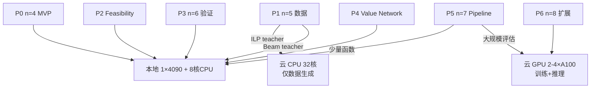

# GNN-SSHR 资源开销与上云计划

> 本文件分析 `gnn-sshr` 各阶段（P0–P6）的 CPU、GPU、内存、时间开销，并给出何时需要上云跑。
> 假设本地机器配置：1–2×RTX 4090（24GB VRAM），多核 CPU，≥64GB RAM。

---

## 1. 开销分类说明

| 资源类型 | 主要消耗在哪里 | 是否可并行 | 是否必须 GPU |
|---|---|---|---|
| **CPU 计算** | ILP 数据生成、候选枚举、图构建、LightGBM baseline | 是（多核） | 否 |
| **GPU 训练** | GNN 模型训练、Value Network 训练 | DDP 可并行 | 是 |
| **GPU 推理** | 候选筛选器前向传播、Value Network 估值 | 否（单次） | 是（可 CPU fallback） |
| **内存 RAM** | 图数据加载、候选缓存、批量训练数据 | — | 否 |
| **磁盘** | 训练数据、模型 checkpoint、结果 CSV | — | 否 |
| **Gurobi License** | ILP 数据生成、SSHR-I baseline | 是 | 否 |

**核心原则**：
- **P0–P2 可在本地完成**：数据量小、模型小、时间短。
- **P3–P4 推荐本地 + 部分并行**：n=6 验证和 Value Network 训练可用 1–2 张 4090。
- **P5–P6 需要考虑上云**：n=7/8 数据生成、训练、推理开销显著增加，单卡/单机可能成为瓶颈。

---

## 2. 各阶段资源开销详表

### 2.1 P0: n=4 MVP — 候选筛选器验证

| 任务 | CPU | GPU | 内存 | 时间 | 备注 |
|---|---|---|---|---|---|
| 复制 SSHR 核心代码到 `src/sshr_core/` | 1 核 | 无 | 低 | 0.5 天 | 一次性 |
| 实现 `graph_builder.py` | 1 核 | 无 | 低 | 1 天 | n=4 图很小 |
| 实现 `candidate_pruner.py` | 1 核 | 无 | 低 | 1 天 | 3 层 HeteroSAGE |
| n=4 ILP 数据生成（222 NPN） | 8 核 | 无 | 中 | 2–4 小时 | 可并行 |
| GNN 训练 | 2 核 | 1×4090 | 8GB | 2–4 小时 | 图很小 |
| 端到端评估 | 4 核 | 无 | 中 | 1 小时 | ILP 求解 |

**总计**：3–5 天，**本地 1×4090 足够**。

**是否上云**：否。

---

### 2.2 P1: n=5 扩展 — 数据与模型

| 任务 | CPU | GPU | 内存 | 时间 | 备注 |
|---|---|---|---|---|---|
| n=5 ILP 数据生成（2,000 函数） | 8 核 | 无 | 中 | **50–70 小时** | 主要瓶颈 |
| 或 n=5 Beam/XOR 数据生成 | 8 核 | 无 | 中 | 1–2 小时 | 低成本替代 |
| 图构建与缓存 | 4 核 | 无 | **16–32GB** | 2–4 小时 | 3.1M 样本 |
| GNN 训练 | 4 核 | 1×4090 | **16–32GB** | 4–8 小时 | hidden=256 |
| 端到端评估 | 4 核 | 无 | 中 | 2–4 小时 | 剪枝 + ILP |

**总计**：5–7 天（若用 ILP），2–3 天（若用 Beam teacher）。

**是否上云**：
- **不需要上云 GPU**：单卡 4090 足够训练。
- **可以考虑上云 CPU**：如果有 32+ 核的云实例，n=5 ILP 数据生成可从 70 小时降到 5–10 小时。
- **替代方案**：用 Beam/XOR teacher 代替 ILP，完全不需要上云。

---

### 2.3 P2: Feasibility Check — Coverage Guarantee

| 任务 | CPU | GPU | 内存 | 时间 | 备注 |
|---|---|---|---|---|---|
| 对 n=5/6 测试 coverage feasibility | 8 核 | 无 | 中 | 4–8 小时 | 可并行 |
| 实现 safety singletons 策略 | 1 核 | 无 | 低 | 1 天 | 开发工作 |
| 调优 keep_ratio | 4 核 | 无 | 中 | 1 天 | 网格搜索 |

**总计**：2–3 天。

**是否上云**：否。

---

### 2.4 P3: n=6 验证 — 端到端对比

| 任务 | CPU | GPU | 内存 | 时间 | 备注 |
|---|---|---|---|---|---|
| n=6 候选枚举（10,299 个） | 1 核 | 无 | 低 | 0.15s/函数 | 可缓存 |
| GNN 推理（10K 候选图） | 1 核 | 1×4090 | 2–4GB | ~50ms/函数 | 可 CPU |
| 剪枝后 Beam / MCTS / ILP | 8 核 | 无 | 中 | 0.2–1s/函数 | 主要开销 |
| 评估 200–1000 个函数 | 8 核 | 无 | 中 | **数小时到 1 天** | 可并行 |

**总计**：3–5 天。

**是否上云**：
- **不需要上云 GPU**：n=6 图小，单卡足够。
- **可能需要上云 CPU**：如果要评估 1000+ 个函数，本地 8 核可能需要 1–2 天。云 32 核可缩短到半天。

---

### 2.5 P4: Value Network — 替换 MCTS Rollout

| 任务 | CPU | GPU | 内存 | 时间 | 备注 |
|---|---|---|---|---|---|
| 生成 state-value 训练数据 | 8 核 | 无 | 中 | 4–8 小时 | 从 ILP/Beam 轨迹提取 |
| 实现 Value Network（MLP/GNN） | 1 核 | 无 | 低 | 1 天 | 模型小 |
| 训练 Value Network | 2 核 | 1×4090 | 4GB | 2–4 小时 | 数据量中等 |
| AI-MCTS 集成与调参 | 4 核 | 1×4090 | 中 | 1–2 天 | 需要反复实验 |
| Benchmark（n=5/6） | 8 核 | 1×4090 | 中 | 1 天 | 对比 MCTS v2 |

**总计**：3–5 天。

**是否上云**：否。

---

### 2.6 P5: n=7 完整 Pipeline — GNN + AI-MCTS

| 任务 | CPU | GPU | 内存 | 时间 | 备注 |
|---|---|---|---|---|---|
| n=7 候选枚举（75,905 个） | 1 核 | 无 | 低 | **2.2s/函数** | 无法避免 |
| GNN 推理（76K 节点图） | 1 核 | 1×4090 | **4–8GB** | **200–500ms/函数** | 单卡可承受 |
| 剪枝后 AI-MCTS | 4 核 | 1×4090 | 中 | **5–30s/函数** | 主要开销 |
| 评估 100–500 个函数 | 8 核 | 1×4090 | 中 | **数小时到数天** | 可并行 |
| 重新训练/微调 GNN | 4 核 | 1–2×4090 | **16–32GB** | 1–2 天 | 若 n=5/6 模型泛化不好 |

**总计**：1–2 周。

**是否上云**：
- **GPU**：本地 1×4090 可以跑，但**评估 500 个函数可能需要数天**。上云 2–4×4090 可并行评估，缩短到 1–2 天。
- **CPU**：n=7 枚举 2.2s/函数 × 500 = 18 分钟，不算瓶颈。
- **内存**：图数据加载可能需要 32–64GB RAM。若本地内存不足，需上云。
- **关键决策点**：如果 P5 要评估 1000+ 个函数，建议上云。

---

### 2.7 P6: n=8 扩展

| 任务 | CPU | GPU | 内存 | 时间 | 备注 |
|---|---|---|---|---|---|
| n=8 候选枚举（609,441 个） | 1 核 | 无 | 低 | **40.6s/函数** | 严重瓶颈 |
| GNN 推理（610K 节点图） | 1 核 | 1×4090 | **16–32GB** | **2–5s/函数** | 显存可能不足 |
| 剪枝后 AI-MCTS | 4 核 | 1×4090 | 中 | **30–120s/函数** | 候选集仍大 |
| 评估 100–300 个函数 | 8 核 | 1×4090 | **32–64GB** | **数天到 1 周** | 必须并行 |
| 预计算/缓存 n=8 候选 | 8 核 | 无 | 低 | 数小时 | 一次性 |

**总计**：1–2 周（若只评估少量函数），更长若要做系统对比。

**是否上云**：**强烈建议上云**：
- **GPU 显存**：610K 节点图 + hidden=256，单卡 24GB 可能不够。需要 **A100 40GB/80GB** 或 **多卡 DDP**。
- **推理速度**：n=8 枚举 40s + GNN 2–5s + MCTS 30–120s，单函数可能 1–2 分钟。评估 300 个函数需要 5–10 小时（并行）到数天（串行）。
- **内存**：n=8 图数据可能需要 **64–128GB RAM**。
- **枚举优化**：610K 候选的枚举 40s/函数无法避免。可以预计算并缓存所有 n=8 平行体（磁盘 ~1GB），但每个函数的 on-set 过滤仍需处理 610K 候选。

---

## 3. 汇总：本地 vs 上云决策矩阵

| 阶段 | 本地可行性 | 推荐配置 | 何时上云 | 上云收益 |
|---|---|---|---|---|
| **P0 n=4 MVP** | ✅ 完全可行 | 1×4090, 8 核 CPU | 不需要 | — |
| **P1 n=5 扩展** | ✅ 可行（用 Beam teacher） | 1×4090, 8 核 CPU | 若坚持 ILP teacher，可上云 32 核 CPU | 数据生成从 70h → 5–10h |
| **P2 Feasibility** | ✅ 完全可行 | 8 核 CPU | 不需要 | — |
| **P3 n=6 验证** | ✅ 可行 | 1×4090, 8 核 CPU | 评估 >1000 函数时上云 32 核 CPU | 评估时间减半 |
| **P4 Value Network** | ✅ 完全可行 | 1×4090, 8 核 CPU | 不需要 | — |
| **P5 n=7 Pipeline** | ⚠️ 可行但慢 | 1–2×4090, 16 核 CPU, 64GB RAM | 评估 >500 函数或内存不足 | 从数天 → 1–2 天 |
| **P6 n=8 扩展** | ❌ 困难 | 2–4×A100, 32 核 CPU, 128GB RAM | **强烈建议** | 否则可能无法完成 |

---

## 4. 上云方案对比

### 4.1 云服务选项

| 平台 | 适用场景 | 优势 | 劣势 |
|---|---|---|---|
| **AutoDL / 恒源云（国内）** | 短期 GPU 训练 | 按小时计费，4090/A100 易得 | 数据上传/下载成本 |
| **阿里云 PAI / 腾讯云 TI** | 大规模训练 | 企业级，支持 DDP | 价格较高 |
| **Google Colab Pro+** | 原型验证 | 便宜，A100 可选 | 不稳定，时长限制 |
| **Lambda Labs / Vast.ai** | 海外 GPU | A100 100GB 可选 | 国内访问可能不稳定 |
| **自建服务器 / 实验室集群** | 长期项目 | 无按小时费用 | 初始投入高 |

### 4.2 推荐的云上配置

**P5 n=7（中度上云）**：
- 1–2×RTX 4090 或 1×A100 40GB
- 16–32 核 CPU
- 64GB RAM
- 预估成本：国内平台 50–150 元/天

**P6 n=8（重度上云）**：
- 2–4×A100 80GB（DDP 训练 + 推理）
- 32–64 核 CPU
- 128GB RAM
- 高速 SSD（缓存 n=8 候选）
- 预估成本：国内平台 500–2000 元/天；海外 Vast.ai 可能更便宜但网络不稳定

---

## 5. 什么时候必须上云？

### 5.1 触发条件

出现以下任一情况时，建议上云：

1. **GPU 显存不足**
   - n=7 GNN 推理 OOM（batch >1 时）
   - n=8 候选图无法装入 24GB VRAM

2. **评估时间不可接受**
   - n=7 评估 500 个函数本地需要 >3 天
   - n=8 单函数推理 >1 分钟，总评估时间 >1 周

3. **需要多 GPU 并行训练**
   - GNN 模型需要 DDP 才能收敛
   - 单卡训练时间 >48 小时

4. **内存不足**
   - n=7/8 图数据加载导致 OOM
   - 批量训练需要 >64GB RAM

5. **需要 Gurobi 并行求解**
   - n=5 ILP 数据生成本地 70 小时太长
   - 云 32 核 + Gurobi WLS Academic License 可加速

### 5.2 不上云的替代方案

如果不上云，可以通过以下方式降低开销：

| 优化 | 效果 | 代价 |
|---|---|---|
| 用 Beam/XOR teacher 代替 ILP teacher | n=5 数据生成从 70h → 1h | 标签质量可能略降 |
| 减少评估函数数量 | 时间线性减少 | 统计显著性下降 |
| 用更小的 GNN（hidden=128） | 训练和推理速度 2–4× | 模型容量下降 |
| n=8 候选预计算 + 采样 | 枚举从 40s → 可忽略 | 可能丢失候选 |
| 只做到 n=7 | 避免 n=8 大开销 | 论文/结果完整性下降 |

---

## 6. 数据存储与传输

### 6.1 本地存储估算

| 数据/模型 | n=4 | n=5 | n=6 | n=7 | n=8 |
|---|---|---|---|---|---|
| 训练数据（CSV/PT） | ~10MB | ~500MB | ~2GB | ~10GB | ~50GB |
| 预计算候选缓存 | ~1KB | ~100KB | ~2MB | ~20MB | ~200MB |
| GNN 模型 checkpoint | ~10MB | ~50MB | ~100MB | ~200MB | ~500MB |
| 结果 CSV | ~100KB | ~1MB | ~5MB | ~20MB | ~50MB |

### 6.2 上云传输

- **训练数据**：P0–P4 数据可本地生成后上传；P5–P6 数据建议直接在云上生成。
- **模型**：本地训练的小模型可上传；大模型建议云上训练、云下推理或云上全流程。
- **代码**：通过 git 同步，避免手动传文件。

---

## 7. 推荐执行计划

### 7.1 最小成本路径

如果预算有限，按此顺序执行：

1. **P0–P4 全部本地**：验证 GNN 方案是否有效。
2. **P5 n=7 本地小批量**：评估 100–200 个函数，确认效果。
3. **若 P5 有效，再上云跑 P5 大规模 + P6 n=8**。
4. **若 P5 无效，停止投入，不上云**。

### 7.2 预算估算

| 阶段 | 本地成本 | 上云成本（推荐） |
|---|---|---|
| P0–P4 | 电费 + 时间 | 不需要 |
| P5 n=7 大规模 | 时间 | 500–2000 元（1–2 周） |
| P6 n=8 | 难以完成 | 3000–10000 元（2–4 周） |

---

## 8. 关键决策 checklist

在决定是否上云前，回答以下问题：

- [ ] P0 MVP 是否成功？GNN 是否比 LightGBM 有优势？
- [ ] 是否必须用 ILP teacher？能否用 Beam teacher 降低成本？
- [ ] n=7 需要评估多少个函数？100 个还是 1000 个？
- [ ] n=8 是否是必须目标？能否只做到 n=7？
- [ ] 本地 GPU 显存是否足够？24GB 是否够用？
- [ ] 本地内存是否足够？n=8 图数据是否需要 128GB？
- [ ] 上云预算是否充足？是否有学术优惠券？

---

## 9. 总结

| 阶段 | 资源开销主要在哪里 | 是否需要上云 | 推荐上云时机 |
|---|---|---|---|
| P0 | 开发 + 小训练 | 否 | — |
| P1 | n=5 ILP 数据生成 | 可选 | 坚持 ILP teacher 且时间紧 |
| P2 | CPU 验证 | 否 | — |
| P3 | n=6 评估 | 可选 | 评估 >1000 函数 |
| P4 | Value Network 训练 | 否 | — |
| P5 | n=7 推理 + 评估 | **建议** | 大规模评估或内存不足 |
| P6 | n=8 枚举 + 大模型 | **必须** | 一开始就上云 |

**最终建议**：
- **先本地跑 P0–P4**，总成本最低，风险可控。
- **P5 根据 P0 结果决定是否上云**：如果 GNN 在 n=4/5/6 都有效，上云 2×4090 跑 n=7 大规模评估。
- **P6 必须上云**：n=8 的 610K 候选和显存需求超出本地 1–2×4090 的能力范围。
